<div align="center">


<br/>

[](https://git.io/typing-svg)

<br/>


<br/>


</div>

<br/>

> **Life OS** is an AI-powered personal productivity operating system that helps users organize their daily life through intelligent task management, goal tracking, notes, progress analytics, reminders, and AI-powered daily reviews — all wrapped in one clean, offline-first mobile experience.

<br/>

---

## 📖 Table of Contents

<details open>
<summary>Click to expand</summary>

- [🌟 Overview](#-overview)
- [✨ Features](#-features)
- [🛠 Tech Stack](#-tech-stack)
- [🏗 System Architecture](#-system-architecture)
- [📁 Project Structure](#-project-structure)
- [🔄 Application Workflow](#-complete-application-workflow)
- [🔔 Notification System](#-notification-system-workflow)
- [🤖 AI Workflow](#-ai-workflow)
- [🗂 State Management](#-state-management)
- [💾 Local Storage](#-local-storage)
- [⚙ Background Services](#-background-services)
- [🔒 Security](#-security)
- [📊 Overall Data Flow](#-overall-data-flow)
- [🚀 Startup Sequence](#-startup-sequence)
- [🎯 Design Principles](#-design-principles)
- [🔮 Future Scope](#-future-scope)
- [👨‍💻 Author](#-author)

</details>

<br/>

---

## 🌟 Overview


Life OS is designed to become a **complete personal operating system** rather than just another task management app.

The application combines:

- 🧠 Smart Task Management
- 🎯 Goal Tracking
- 📝 Daily Notes
- 🤖 AI Reviews
- 🔔 Intelligent Notifications
- 📊 Progress Analytics
- 🔐 Secure Authentication

...into one seamless mobile experience.

Life OS follows a **clean layered architecture** where the frontend, backend, database, notification services, and AI services work independently while communicating through secure APIs.

<br clear="right"/>

---

## ✨ Features

<table>
<tr>
<td width="50%" valign="top">

### 🔐 Authentication
- Email Login
- Google Sign In
- JWT Authentication
- Forgot Password
- Secure Session Management
- Profile Management

### ✅ Task Management
- Create / Edit / Delete Tasks
- Mark Complete
- Task Priorities
- Task Date & Time
- Task Descriptions
- Recurring Tasks

### 📝 Notes
- Daily Notes
- Edit / Delete Notes
- Date-based Storage

</td>
<td width="50%" valign="top">

### 🎯 Goals
- Create / Edit / Delete Goals
- Goal Progress Tracking

### 📊 Progress
- Daily Progress
- Weekly Progress
- Monthly Progress
- Completion Statistics

### 🤖 AI
- Daily AI Review
- Weekly Review
- Monthly Review
- Intention Memories

### 🔔 Notifications
- Morning Reminder
- Task / Goal Reminder
- Daily Summary
- AI Review Reminder
- Intention Reminder
- Engagement Reminder
- Midnight Reset

</td>
</tr>
</table>

---

## 🛠 Tech Stack

<div align="center">

### Frontend


### Backend


### Database & AI


### Deployment


</div>

---

## 🏗 System Architecture

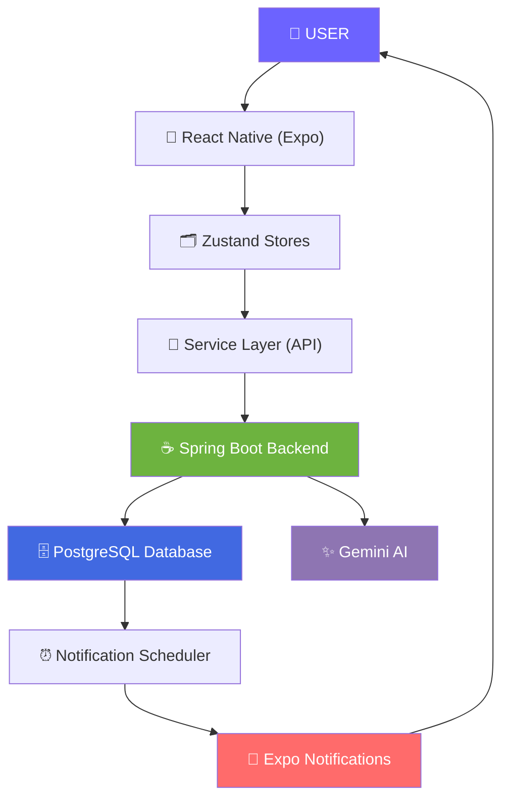

---

## 📁 Project Structure

```
app/
├── (auth)
├── (tabs)
├── (ai)
├── profile
├── notes
├── goals
└── _layout

src/
├── components
├── services
│   ├── api
│   ├── notification
│   ├── auth
│   └── ai
├── store
│   ├── auth
│   ├── task
│   ├── progress
│   ├── note
│   └── goal
├── hooks
├── constants
├── utils
├── theme
└── types
```

---

## 🔄 Complete Application Workflow

<details>
<summary><strong>1️⃣ Application Launch</strong></summary>

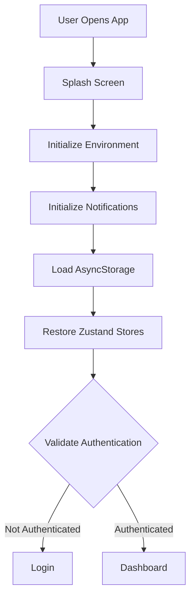

</details>

<details>
<summary><strong>2️⃣ Authentication Workflow</strong></summary>

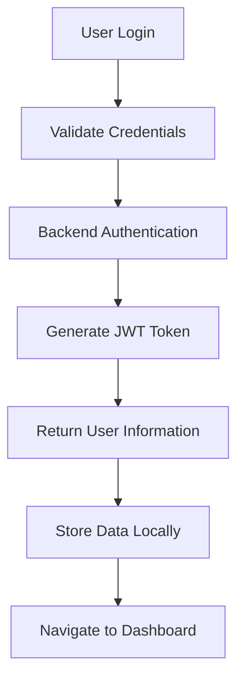

</details>

<details>
<summary><strong>3️⃣ Dashboard Loading</strong></summary>

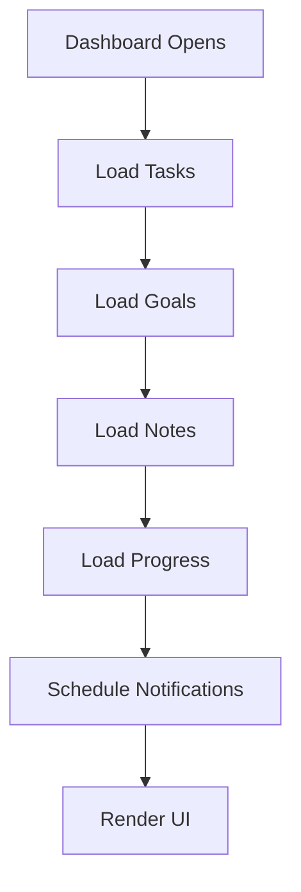

</details>

<details>
<summary><strong>4️⃣ Task Workflow</strong></summary>

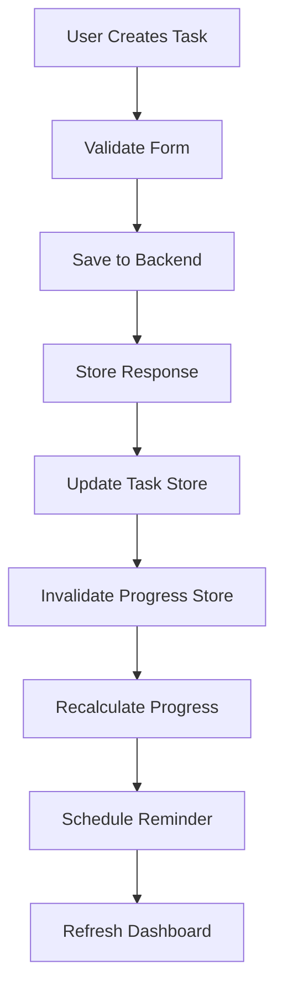

</details>

<details>
<summary><strong>5️⃣ Task Completion Workflow</strong></summary>

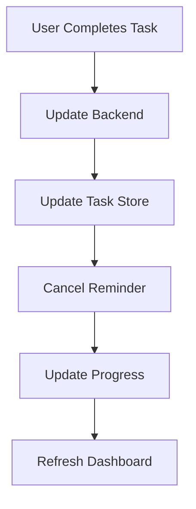

</details>

<details>
<summary><strong>6️⃣ Goal Workflow</strong></summary>

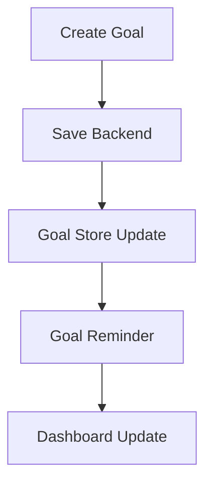

</details>

<details>
<summary><strong>7️⃣ Notes Workflow</strong></summary>

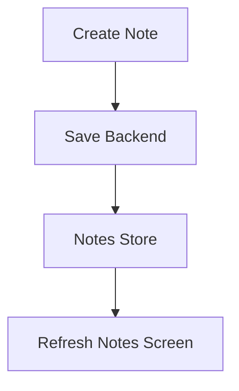

</details>

<details>
<summary><strong>8️⃣ Progress Workflow</strong></summary>

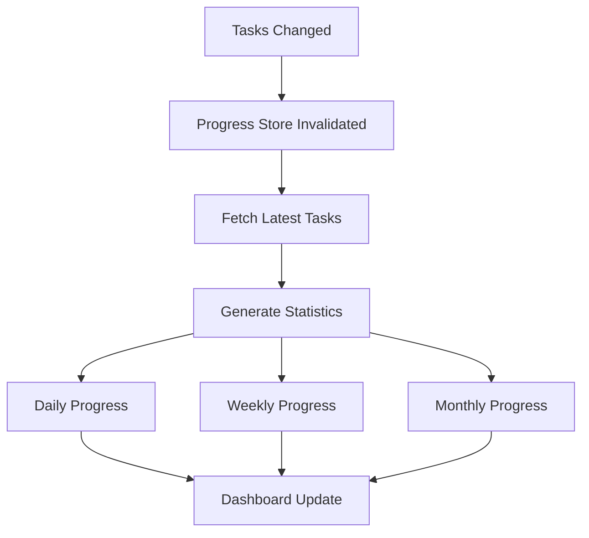

</details>

---

## 🔔 Notification System Workflow

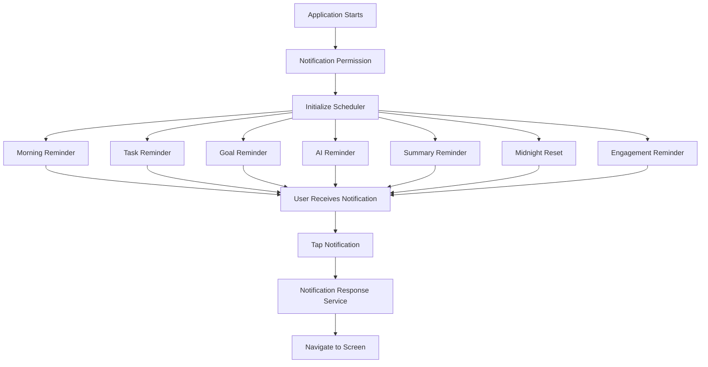

---

## 🤖 AI Workflow

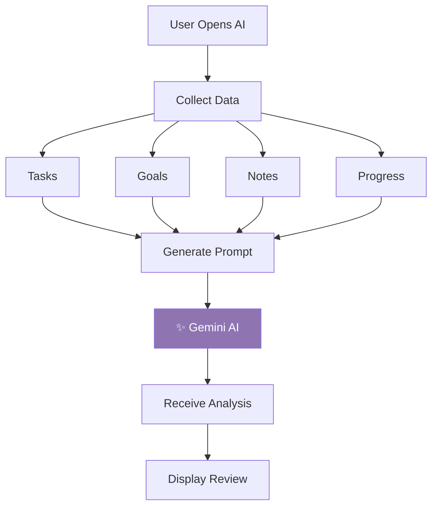

---

## 🗂 State Management

The application uses **Zustand** for global state management.

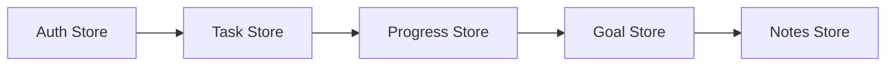

> Each store is responsible only for its own domain while communicating with other stores when required.

---

## 💾 Local Storage

The application stores required information locally to improve performance and support offline persistence:

| Data | Purpose |
|------|---------|
| 🔑 Authentication Token | Session persistence |
| 👤 User Information | Profile display |
| ✅ Cached Tasks | Offline access |
| 📝 Cached Notes | Offline access |
| 🎯 Cached Goals | Offline access |
| 📊 Progress Cache | Fast dashboard load |
| 🎨 Theme Preferences | UI personalization |

---

## ⚙ Background Services

Life OS initializes several background services during startup:

- 🔐 Authentication Restoration
- 🔔 Notification Scheduling
- 🔁 Reminder Synchronization
- 📊 Progress Synchronization
- 💧 Store Hydration
- ✅ Cache Validation
- 🤖 AI Reminder Scheduling

---

## 🔒 Security

<div align="center">


</div>

- JWT Authentication
- Password Encryption
- Secure Session Validation
- Protected Routes
- Input Validation
- Secure Local Storage
- HTTPS Communication

---

## 📊 Overall Data Flow

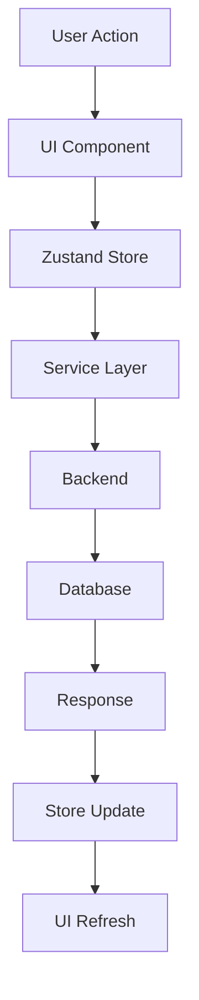

---

## 🚀 Startup Sequence

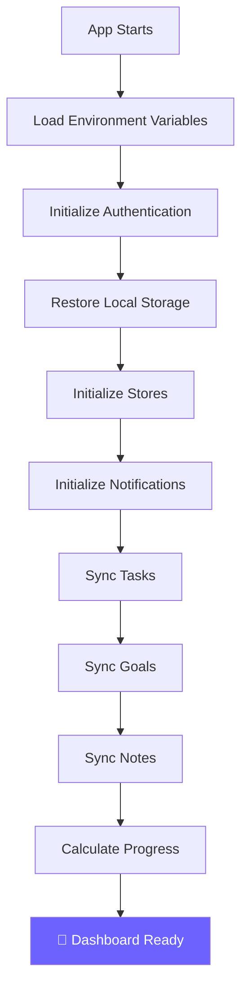

---

## 🎯 Design Principles

<div align="center">

| Principle | Principle |
|-----------|-----------|
| 🏛 Layered Architecture | 🧩 Single Responsibility Principle |
| ✂️ Separation of Concerns | 🔄 State-driven UI |
| 📴 Offline-first Caching | 🧱 Modular Services |
| 🧹 Clean Code Structure | ♻️ Reusable Components |
| 🛡 Type Safety | 📈 Scalable Design |

</div>

---

## 🔮 Future Scope

- [ ] 🤖 AI Agent Automation
- [ ] 🎙 Voice Assistant
- [ ] 📅 Calendar Integration
- [ ] 📧 Email Integration
- [ ] 🔁 Habit Tracking
- [ ] ⏱ Pomodoro Timer
- [ ] 🧠 Smart Scheduling
- [ ] 🧬 AI Memory System
- [ ] 🔗 Cross-device Synchronization
- [ ] 👥 Team Collaboration
- [ ] ⌚ Wearable Device Support
- [ ] 🖥 Desktop Application

---

## 👨‍💻 Author

<div align="center">

### **Pragateesh Hari**

*Life OS is a personal AI-powered productivity operating system built to help users organize their life intelligently while providing actionable insights through AI.*


</div>

<br/>


</div>
