

 

 

## 🧭 Table of Contents

| [🚀 Overview](#-overview) | [🏗️ Architecture](#️-architecture) | [🔐 Auth Flow](#-authentication-flow) | [✅ Tasks](#-task-management) |
|:---:|:---:|:---:|:---:|
| [🎯 Goals](#-goal-management) | [📓 Journal](#-daily-journal) | [📊 Progress](#-progress-calculation) | [🤖 AI Review](#-ai-review-engine) |
| [🔔 Notifications](#-notification-system) | [🖥️ Backend](#️-backend) | [🗄️ Database](#️-database) | [☁️ Deployment](#️-deployment--cicd) |

---

## 🚀 Overview

**Life OS** is a full-stack personal productivity system that unifies **Tasks**, **Goals**, **Journaling**, **Progress Analytics**, and **AI-Powered Reviews** into a single mobile-first experience — backed by a robust Spring Boot + PostgreSQL infrastructure and driven by smart, scheduled notifications.

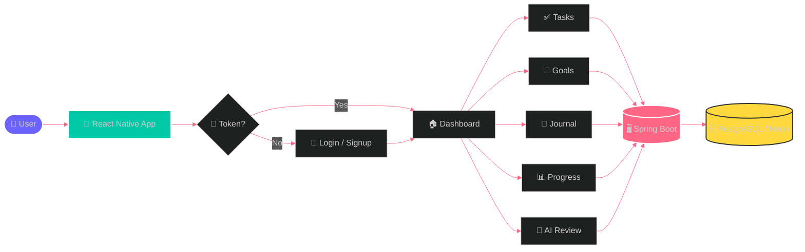

---

## 🏗️ Architecture

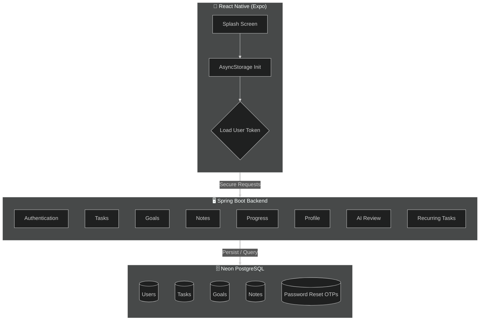

---

## 🔐 Authentication Flow

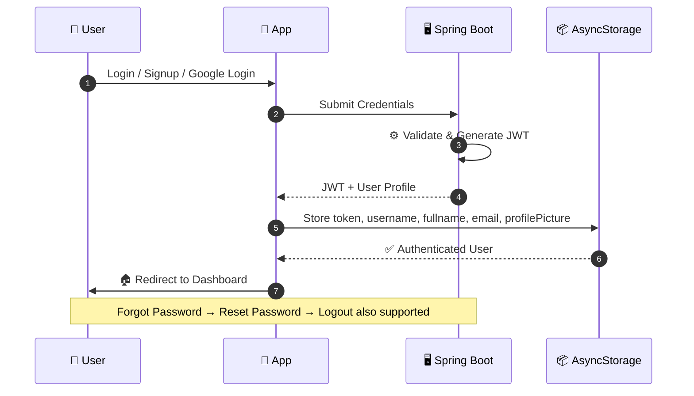

**Capabilities:** `Login` · `Signup` · `Google Login` · `Forgot Password` · `Reset Password` · `Logout`

---

## 🏠 Home Page

| Widget | Description |
|---|---|
| 📝 **Today's Tasks** | Everything due today, at a glance |
| 🎯 **Today's Goals** | Active goals and deadlines |
| 📓 **Today's Journal** | Quick entry to today's note |
| 📈 **Daily Progress** | Live completion snapshot |
| ⚡ **Quick Actions** | One-tap create for tasks/goals/notes |
| 🤖 **AI Review** | Smart daily productivity insights |

---

## ✅ Task Management

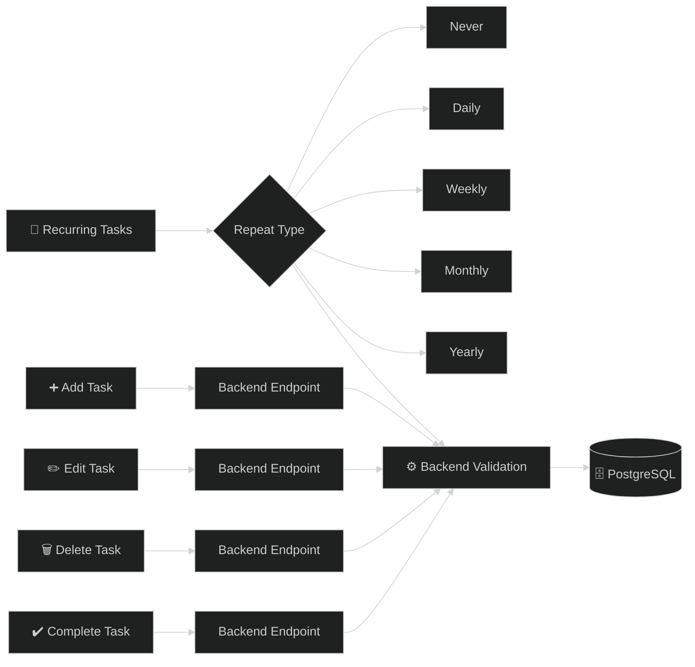

---

## 🎯 Goal Management

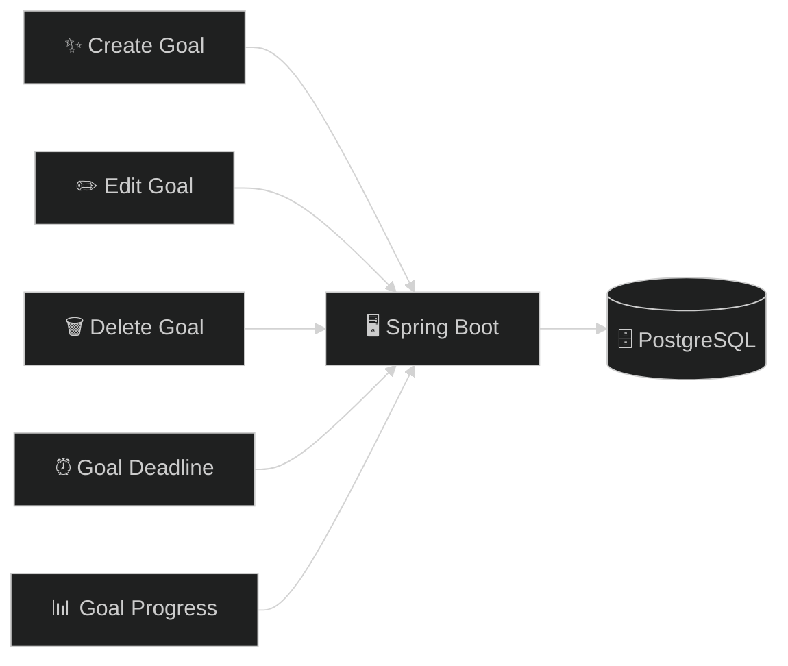

---

## 📓 Daily Journal

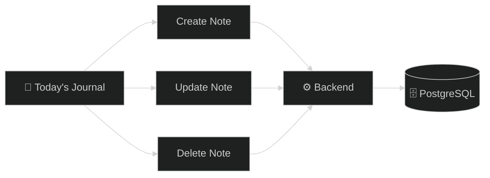

---

## 📊 Progress Calculation

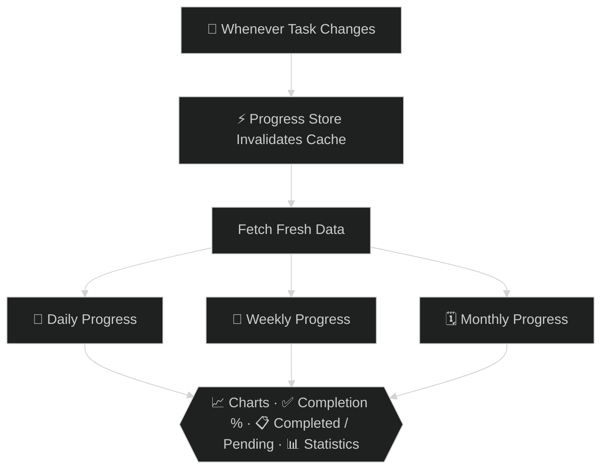

---

## 🤖 AI Review Engine

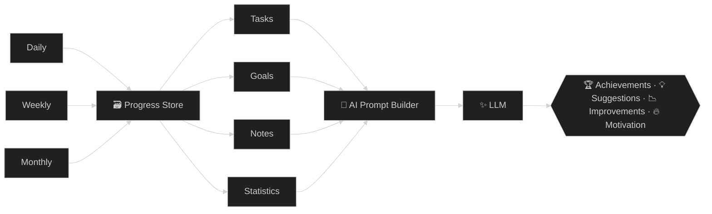

---

## 🔔 Notification System

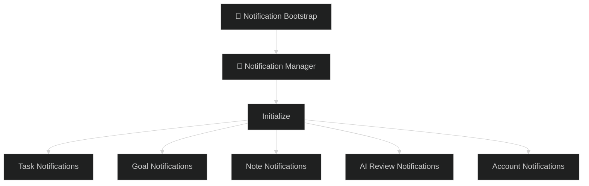

### ⏱️ Task Notifications
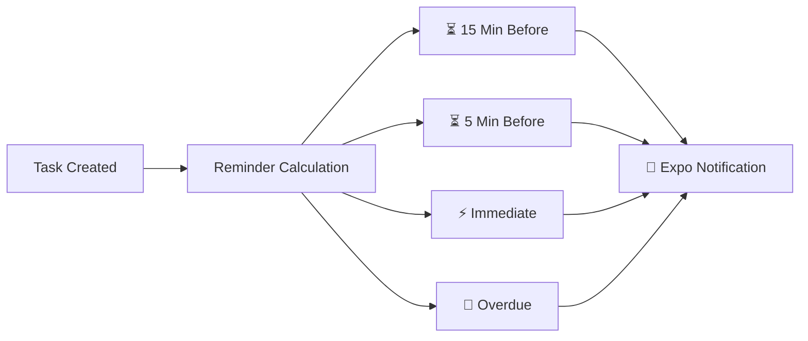

### 🎯 Goal Notifications
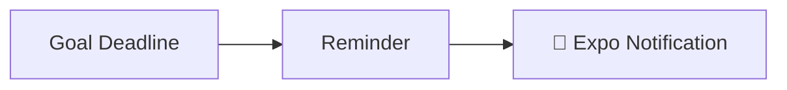

### 📓 Daily Journal Notification

| Condition | Notification |
|---|---|
| ✅ Note exists | **📝 Journal Completed** — *Great work! You've already written today's journal.* |
| ❌ Note missing | **📝 Daily Journal Reminder** — *Don't forget to write today's journal before your day ends.* |

⏰ Scheduled Daily at **9:30 PM**

### 🤖 AI Review Notifications

| Frequency | Time |
|---|---|
| 📅 Daily | 9:15 PM |
| 📆 Weekly (Sunday) | 9:15 PM |
| 🗓️ Monthly (Last Day) | 9:15 PM |

### 👆 Notification Response Routing
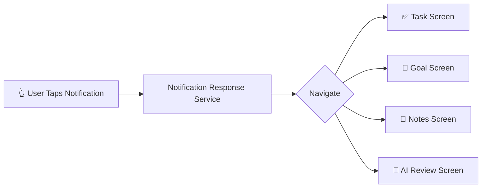

---

## 🖥️ Backend

**Spring Boot** powers: `Authentication` · `Tasks` · `Goals` · `Notes` · `Progress` · `Profile` · `AI Review` · `Recurring Tasks`

---

## 🗄️ Database

**PostgreSQL (Neon)** tables: `Users` · `Tasks` · `Goals` · `Notes` · `Password Reset OTPs`

---

## ☁️ Deployment & CI/CD

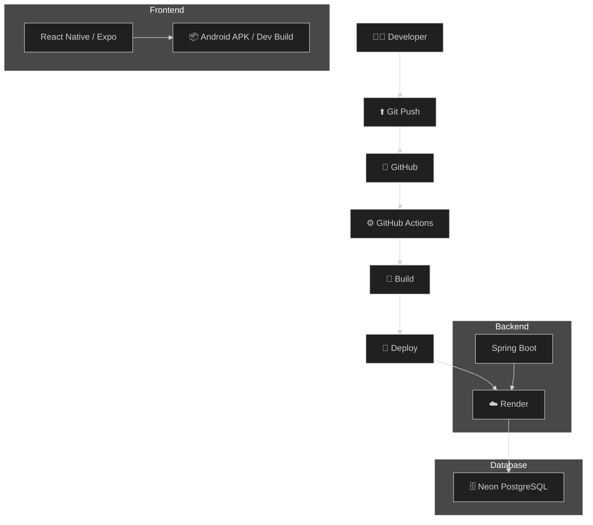

### 💓 Backend Keep-Alive

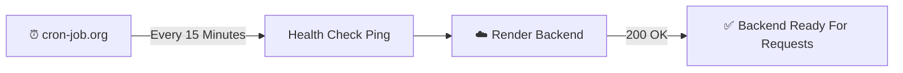

---

## 🌀 Complete Flow

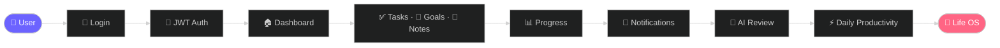

---

### 💜 Built with passion for productivity

